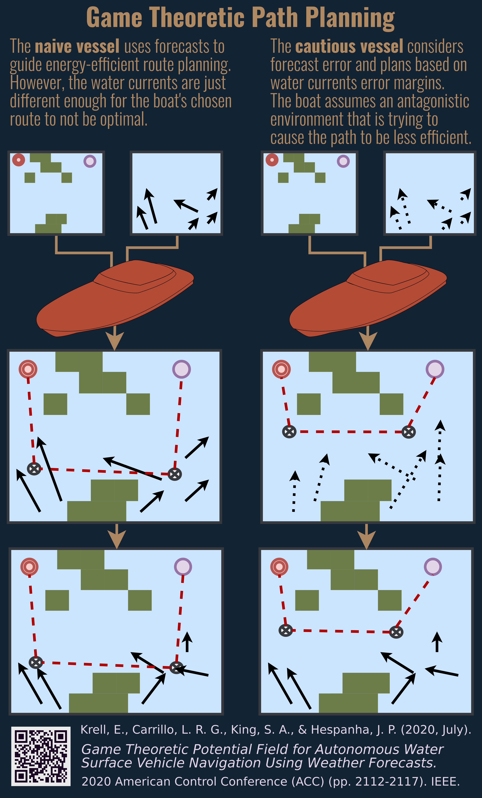

## fujin

A game-theoretic path planner.

[Publication](https://ieeexplore.ieee.org/iel7/9140048/9147203/09147292.pdf?casa_token=fJufPz86q6oAAAAA:uN8RqFuwsaWv3fW0eVYpekKrWaLzh-5McAG_25qWrAq7xLM39ichWOK2rfwLmS8wuv5qRHVpFmbmVN0)

		Krell, E., Carrillo, L. R. G., King, S. A., & Hespanha, J. P. (2020, July). 
		Game Theoretic Potential Field for Autonomous Water Surface Vehicle Navigation Using Weather Forecasts. 
		In 2020 American Control Conference (ACC) (pp. 2112-2117). IEEE.

### Based on

    Robot motion planning: A game-theoretic foundation. S. M. LaValle. Algorithmica, 26(3):430--465, 2000.

### Directory Structure

	fujin
	├── test
	│   ├── data
	│   ├── games
	│   ├── results
	│   └── scripts
	└── tools

- __fujin:__ Python code for executing path planner.
- __test:__ Sample data and outputs.
- __games:__ Sample 2-player 0-sum games generated by path planner.
- __scripts:__ For generating results to analyze planner's effectiveness.
- __tools:__ Small programs that support path planner. May be useful for data preparation.

### Solving 2-player, 0-sum Matrix Games

The code is set up such that a method parameter could be used to select
a desired algorithm for solving matrix games. Only one is currently supported.

- **Williams**: Approximate, iterative solver. 
    - Numeric selection flag: 0
    - Code: solver_tools.py -> solve_williams()
    - Source: code.activestate.com/recipes/496825-game-theory-payoff-matrix-solver/

### Examples

A number of examples are found in _test/scripts/_

### Tools

__Example Ta: Convert geotiffs of magnitude and direction to u,v components (all bands)

        python tools/magdir2uv \
            -m wind_mag.tif    \  # Input magnitude as this geotiff
            -d wind_dir.tif    \  # Input direction as this geotiff
            -u wind_u.tif      \  # Store u as this geotiff
            -v wind_v.tif      \  # Store v as this geotiff
            -s 3                  # Scale all magnitude by this float

__Example Tb: Solve a single game

       python solve_game \
           -g game.txt   \ # Input game as numpy txt archive
           -i 100          # Number of solver iterations

### Misc

If you need to convert an ASCII map or force component grid to geotiff:

        gdal_translate -of "GTiff" fname.asc outname.tif

See [StackOverflow](https://gis.stackexchange.com/a/62629) for more information. 

### Todo

- [X] Accept geotiff
- [X] Accept grid of errors
- [X] Accept grid of weights
- [X] Measure solver results
- [X] Track convergence
- [X] Pandas convergence
- [X] Graph convergence
- [X] Graph path and actionspace
- [X] Decide output format
- [X] Convert to waypoints
- [X] Specify subregion to solve
- [X] 16 direction movement
- [X] Save convergence history as pickle
- [ ] solvertools: assumes 16-way movement
- [ ] Need separate error for u and v components
- [ ] Need separate action selection for u and v components
- [ ] env_setup -> getComponentGrid: why does it accept band parameter, then use 1 anyway?
